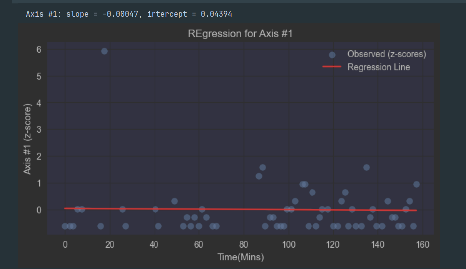
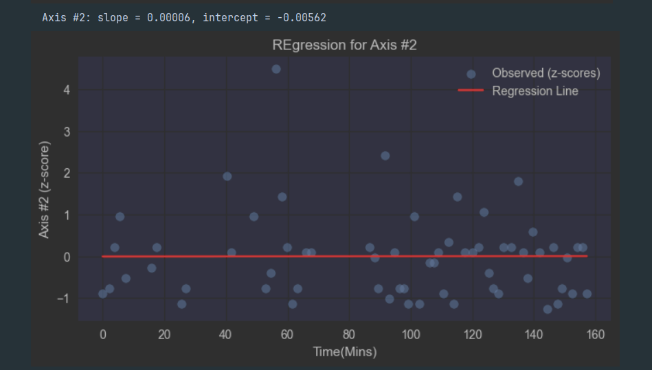
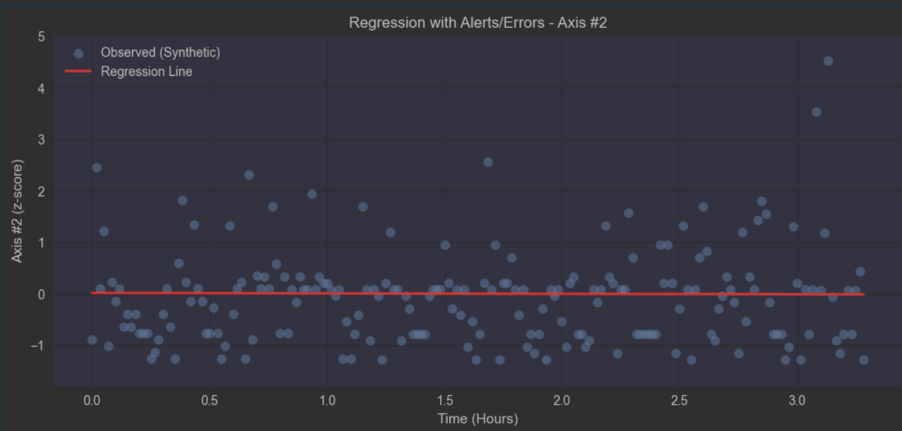

# Practical Lab 1: Streaming Data for Predictive Maintenance With Linear Regression Based Alerts

##  Project Members:
    1. Jarius Bedward #8841640

## Project Summary:

This project was built off of the Data Streaming Workshop
in which we analyze time-series sensor data from a manufacturing system to detect abnormal 
behaviour using regression and residual analysis. 

**Key Features:**
- **Data Preprocessing:**
  - Filter out rows where all sensor readings are zero
  - Fill missing values
  - Normalize and standardize data fro consistent modeling
- **Regression Modelling:**
  - Linear regression on each sensor axis
  - Identification of slope and intercept for analysis
- **Synthetic Data Generation**
  - Generate synthetic test data based on regression predictions
  - Adding realistic deviations using residuals from the traning data
- **Residual Analysis:**
  - Analyze residuals to determine threshold limits for alerts and errors
  - Visualization of residual distributions
-  **Alert and Error Detection:**
  - Detect continuous periods exceeding thresholds
  - Log alerts and errors with start/end timestamps
- **Visualization:**
  - Scatter plots with regression lines
  - Overlay of alerts as (yellow) and errors as (orange) with duration annotations
- **Results Saving:**
  - Export thresholds and detected events to CSV reporting

## Requirements:
    - pip install -r requirements.txt

##  🎯  How to Run:

1. Clone this repo (git clone <repo-url> cd <repo-folder)
2. Install Required Dependencies: "pip install -r requirements.txt"
4. Create a new .env file containing your Neon database URL
5. In the env file add the connection string from Neon ( DATABASE_URL=<your_database_url> )
6. Run all the cells within the notebook

## Code Explanation/Workflow:

1. **Import Libraries**
   - We import the libraries for data manipulation (pandas, numpy), plotting (matplotlib), regression(sklearn), database connection sqlalchemy
   
2. **Connect to Neon DB & Load Data**
   - We have the data go to one column per axis and any missing values are filled with 0. Time is also converted to datetime for easier manipulation
   - create_engine(DB_URL) is prominent as it establishes the connection of the db
   - pd.read_sql() loads the queried data into the dataframe
   - pivot_table() restructures long format sensor data into a wide format where each axis is a column
   
3. **Filter out Zeros**
   - Any row that had all axes as zero are removed
   - any(axis=1) checks if any axis has a non zero reading
   - It only keeps the valid sensor readings so it can be used for regression and residual calculations
   
4. **Normalization** 
   - MinmaxScaler() scales each feature to a range between 0 and 1. Normalizing makes sure that no single axis dominates the analyses
   
5. **Standardization**
   - Helps with linear regression handle data that may have different ranges or units
   - StandardScaler() standardizes the z-scores (mean=0, std=1)
   
6. **Regression Modelling and Residuals**
   - Linearregression() is a key function since it fits the line to the data and models the relationship between time(x) and the reading(y) as a linear equation
   - Residuals (y - y-pred) is used to detect anomalies 
   - df_std.iloc[::30]  selects every 30th row from the standardized dataframe, reducing teh clutter oof points while still preserving the overall trend.
   
7. **Generate Synthetic Data**
   - pd.date_range() generates the synthetic timestamps
   - Synthetic readings are created from adding residuals to the regression line which makes sure the synthetic data will follow the realistic deviations
   
8. **Residual Analysis on Synthetic Data**
   - Residuals on synthetic data are calculated to see if the synthetic data closely follows the regression model
   - The residuals are also used later for alert and error detection
   
9. **Define Alert & Error Min Max**
   - np.percentile() is used to define the thresholds. For alerts it is the 80th and for errors it is the 90th percentile
   - Thresholds define what counts as abnormal deviation
   
10. **Detect Alerts and Errors**
    - find_periods() finds continuous periods where the residual exceed thresholds

11. **Overlay Alerts & Errors on Regression Plot**
    - This step visualizes both the regression line and timed alerts and errors
    - plt.tspan() highlights periods of abnormal behaviour

12. **Save Results**
    - pd.DataFrame.from_dict() converts the thresholds dictionary into a dataframe
    - The results are saved locally]

### Further Explanation of regression/alert rules: 
    - Linear Regression is used to model the trend of each axis overtime. Standrdization is applied to put all axes on the same scale
    - Resiudals represent how far the reading is from the predicted regresion value.
    - To define the thresholds for alerts and erros the residuals are used to do so.
    - To try to avoid false posivities we detect contious periods where residuals exceed thresolds
    - Alerts and erros are logged whenever the residuals exceed the thredholds and are overlaid on the regression plot for visualization
    - The alerts and erros are also saved to a csv file for easier viewing

## Screenshots of Plots: 
(For space’s sake I will show two plots from each time a plot was created)

**Regression Line**

**Residuals (Synthetic)**
.png)

**Regression with Alert & Error overlay**

### Notes:
- I read the data from the neon database to train the linear regression model however I still will include the
original csv from the workshop that was used for the database in the data folder
- The other csv's are generated from the lab
- The regression plots tend to be more flatter than usual I believe this could be due to the data from the database and how it was structured but it could also be how I normalized/standardized it

🤝 Contributing
This is a Practical Lab developed for CSNC8010. If any questions arise do not hesitate to contact the project member.